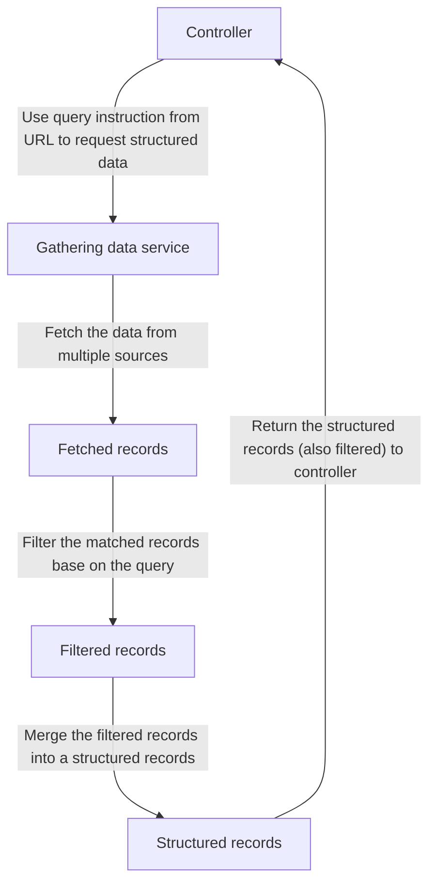
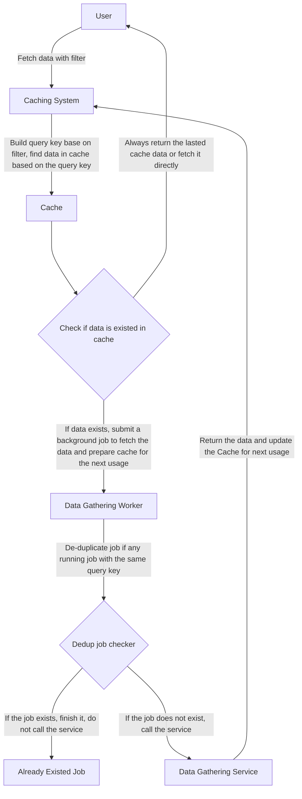

# JSON Data Gatherer
This is a rails-api which will fetch the hotels json data from multiple sources and merge the data to one structure (resolve the conflict between the data related to the same hotels).

# Usage
Call the api via Heroku: https://hotel-api-huyphung.herokuapp.com/hotels/index
- Query data using hotel ids: `/hotels?hotels[]=SjyX&hotels[]=iJhz`
- Query data using destination ids: `/hotels?destinations[]=5432`
- Query data using both hotel ids and destination ids: `/hotels?destinations[]=5432&hotels[]=iJhz`

# High Level Design
There are two main parts of this service. The first one is fetchning the data. The second one is merging the data into a structure.

## Concepts
- **Merging Row**: Merging row is a row that is selected to merge with the next conflict row (raw row) when merging the data.
- **Raw Row (conflict row)**: The row we have when looping through the array of JSON row after filtered data.
- **Merged Row**: The row after we merged the merging row and the raw row.
## Gathering Data Service
The gathering data service is created for reusability and expandability. Currently, we have a Hotel source. However, we could easily add a new source (such as Restaurants).
### Fetch Data
Fetching the data from multiple sources. In the current scope, we only need to fetch the data from the 3 URLs. However, this codes I prefer to define the codes as general as I could. Checking the DataSource could help
you to imagine how to expand the number of URLs, adding the new source of data (not only Hotel source).

### Filter Data
Based on the URLs that I was provided. We have no option to fetch the data by page. So I have to fetch all the data.
We filter the database on the hotel_id or destination_id before merging the data to improve the performance of the merging step.

### Merge Data
The gathering service loop through each record. This loop only performs one time (with n, is the number of filtered records). I use a HashMap here to select the **merging row** based on the id of the **raw row**.

The merging operation will be performed inside the **Merger**. The merger received **merging row** and **raw row**. Data will be merged following the below rules (I write this one specifically for the Hotel Merger):
- Loop through each key. Use a HashMap to decide the correct column to be merged.
- Empty data will be merged.
- String data will be selected by the longest string.
- Some special columns such as location, images, amenities (for Hotel source) we defined the specific merge mechanic
- Location dimensions such as latitude, longitude, address, city, country will be merged inside.
- Images merger will filter out the duplicated image URLs, and merged all categories (amenities, rooms, site).
- Amenities are merged to select all available amenities from all of the URLs. The amenities are split into 2 categories: general, room.

# Testing
I wrote the unit tests for the most of the logics. You could run the test by this cli command:
`bundle exec rspec`

# Optimization
There are 3 main parts:
- Fetching the data.
- Filter the data.
- Merging the data.

## Filter the data
We filter out the data before merging it. It will reduce the number of records we need to perform the merging operation.

## Merging the data
When merging the data, I try to use HashMap to reduce the number of records the service needs to loop through. The complexity of this merging service can be considered as `O(n records * m keys)` (nested keys also counted).

## Fetching the data
When there is a large number of records. Fetching the data will be painful. I realized that the data here is not sensitive enough (there is no billing data). So we could cache the data into Redis for later use. We also use Sidekiq to call the background job for the next cache. The cache mechanic diagram is here:

To be simple, the rules are:
- Always fetched data from the lasted cache with the key is the query key.
- If data is not in cache or the cached data is expired, we fetch the data directly and the user has to wait (first time fetching)
- If data exists in the cache:
  - We fetch the data inside the **Redis** cache instead.
  - We submit a background job using **Sidekiq**:
    - If there is a background job **with the same query key is running**. We finish the job.
    - If not, we fetch the data for **next time the user submits the same query key**.

# Technologies and Deployments
## Technologies
- Codes are deployed to **Heroku**.
- I use the **PostgreSQL** database to store cache records and job records.
- I use **Redis** add-on to store fetched data inside the cache
- I use **Sidekiq** for background job.
- I use **Rspec**, **VCR** for testing.

## Deployment
- The PostgreSQL user and password are managed by Heroku.
- Use Heroku Redis.
- 2 Dynos:
  - One dyno called web to run puma
  - One dyno to run Sidekiq

# Other consideration of improvements
## Code Structures
- The HotelMerger could be refactored more to improve the readability
## CI/CD
- I did not set up the CI/CD for this one.

## Performance
- Using the query key and caching system could save time. Moreover, where there is a full set of data in the cache. We could think about filtering the full set of data instead of fetching the new data based on the filter.

## Debugging
- We could add a model called JobLog to track the progress of the job. We also can modify the log level (info, error, debug, etc) for further usage.